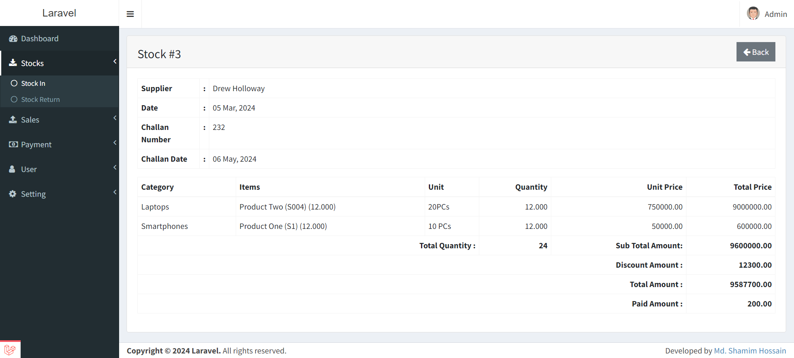

# Inventory Management System - xInventory

----------

# Getting started

## Installation

Clone the repository or downlaod the project from github

    git clone https://github.com/shamim192/xInventory.git

Copy this project in htdocs folder and open the folder location in cmd.

Now rename the "env.example" file to ".env"

You can configure the database informations here.

Now open cmd and run some commands...

Install all the dependencies using composer

    composer install

Generate a new application key

    php artisan key:generate

Run the database migrations (**Set the database connection in .env before migrating**)

    php artisan migrate 

now seed data using 
    
    php artisan db:seed 

Start the local development server

    php artisan serve

You can now access the server at http://localhost:8000
    

## Admin Login Credentials

email: admin@gmail.com 

password: 12345678

**you can change it from database as per your need.

let's have a look at some screenshots of the project pages

## Log In page

# 

## Dashboard

# 

## Product

# 

## Stock 

# 

## Stock  Show 

# 

## Stock  Return 

# 

## Sale 

# 

## Sale  Show 

# 

## Customer Payment 

# 

## Customer Adjustment 

# 

## Income 

# 